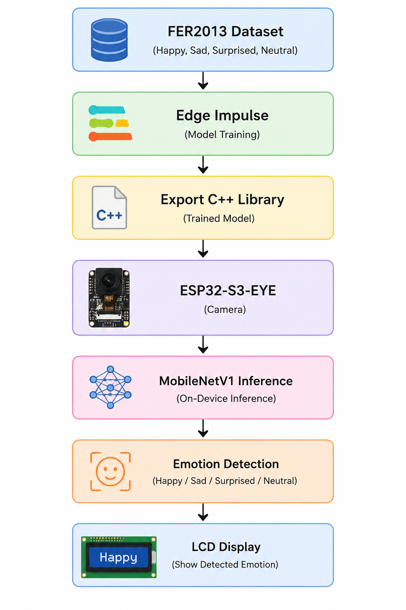
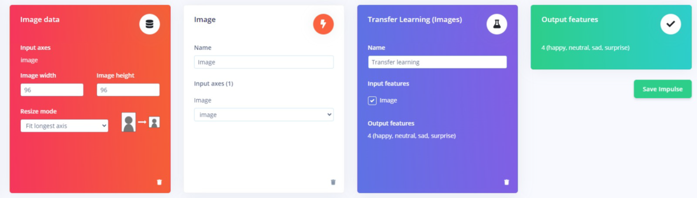
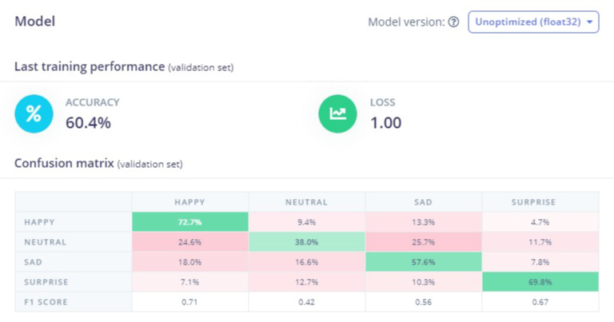
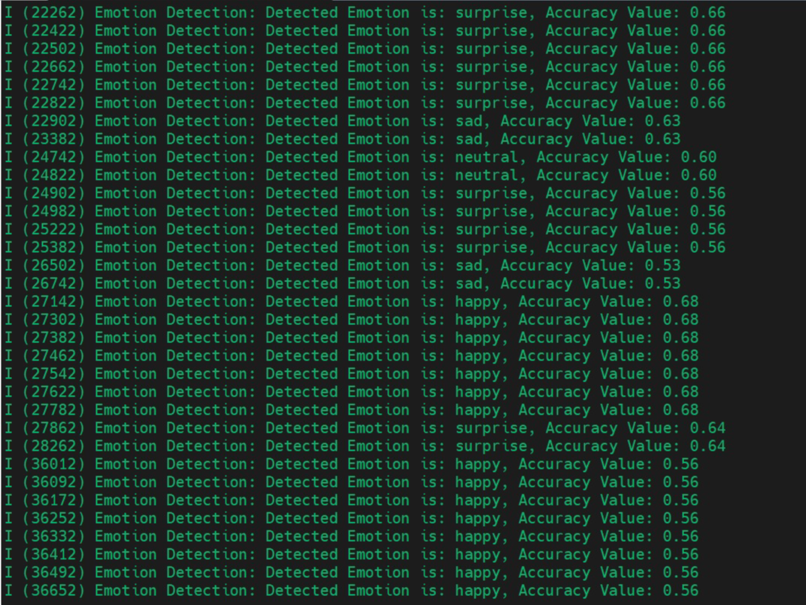

# Facial Emotion Recognition in Work Environment using ESP32-S3-EYE

A real-time facial emotion recognition system developed using the **ESP32-S3-EYE** development board and **Edge Impulse**. The system performs on-device emotion classification using a lightweight **MobileNetV1** transfer learning model and recognizes four facial emotions: **Happy, Sad, Surprised, and Neutral**.

The project demonstrates how edge AI enables low-latency, privacy-preserving emotion recognition by performing inference directly on the embedded device without cloud connectivity.

---

# Project Overview

Facial emotion recognition has become an important application of computer vision and embedded artificial intelligence. This project presents an edge AI solution that captures facial images using the ESP32-S3-EYE camera, classifies emotions locally using a trained MobileNetV1 model, and displays the detected emotion in real time.

Unlike cloud-based approaches, all inference is executed directly on the ESP32-S3-EYE, reducing latency and preserving user privacy.

---

# Features

- Real-time facial emotion recognition
- On-device inference using ESP32-S3-EYE
- MobileNetV1 Transfer Learning model
- Edge Impulse deployment
- Four emotion classes
  - 😊 Happy
  - 😢 Sad
  - 😲 Surprised
  - 😐 Neutral
- Lightweight edge AI implementation
- LCD-based real-time output

---

# System Workflow

The complete workflow of the proposed system is shown below.



---

# Hardware Platform

The project uses the **ESP32-S3-EYE** development board with an integrated camera and LCD display.


*Source: Espressif Systems.*

---

# Model Development

The emotion recognition model was trained using the **Edge Impulse** platform.

The training pipeline consists of

- Data acquisition
- Image preprocessing
- Feature extraction
- MobileNetV1 transfer learning
- Model optimization
- Model export as a C++ library



---

# Hardware

- ESP32-S3-EYE
- Built-in Camera
- LCD Display
- USB Interface

---

# Software & Tools

- Edge Impulse
- Arduino IDE
- ESP-IDF
- C++
- MobileNetV1
- FER2013 Dataset

---

# Dataset

The project uses the **FER2013** facial expression dataset.

### Dataset Summary

| Item | Value |
|------|------:|
| Total Images | 4925 |
| Training Images | 3940 |
| Testing Images | 985 |
| Emotion Classes | 4 |

Recognized emotions:

- Happy
- Sad
- Surprised
- Neutral

---

# Model Configuration

| Parameter | Value |
|-----------|-------|
| Framework | Edge Impulse |
| Backbone | MobileNetV1 96×96 0.1 |
| Input | Grayscale 96×96 |
| Hidden Layer | 16 Neurons |
| Output Classes | 4 |

---

# Methodology

1. Collect the FER2013 facial expression dataset.
2. Train a MobileNetV1 model using Edge Impulse.
3. Export the trained model as a C++ library.
4. Deploy the model to the ESP32-S3-EYE.
5. Capture facial images using the onboard camera.
6. Perform on-device inference.
7. Display the detected emotion on the LCD.

---

# Experimental Results

## Model Performance

| Method | Accuracy |
|---------|----------:|
| Test Dataset | **60.40%** |
| Raspberry Pi 4B + Webcam | 43.65% |
| ESP32-S3-EYE + Built-in Camera | 39.84% |

### Real-Time Performance

- Camera Resolution: **240 × 240**
- Processing Speed: **≈5 FPS**
- Real-time emotion recognition on the ESP32-S3-EYE

---

## Confusion Matrix

The confusion matrix obtained after training demonstrates the classification performance for the four emotion classes.



---

## Real-Time Deployment

The trained model was successfully deployed to the ESP32-S3-EYE and evaluated in real-time using live facial expressions.



---

# Applications

- Workplace well-being monitoring
- Human-computer interaction
- Smart office systems
- Edge AI
- IoT-based emotion recognition

---

# Future Work

- Add additional emotions such as Fear, Anger, and Disgust.
- Improve real-world accuracy using a larger dataset.
- Increase robustness under varying lighting conditions.
- Collect a custom dataset using the ESP32-S3-EYE.
- Add long-term emotion analytics and logging.


---

# Getting Started

Clone the repository

```bash
git clone https://github.com/yourusername/facial-emotion-recognition-esp32.git
```

Open the project in **Arduino IDE** or **ESP-IDF**, add the exported Edge Impulse library, and upload the firmware to the ESP32-S3-EYE.


---

# References

1. Espressif Systems. *ESP32-S3-EYE Getting Started Guide*  
   https://github.com/espressif/esp-who

2. Edge Impulse  
   https://edgeimpulse.com/

3. FER2013 Dataset  
   https://www.kaggle.com/datasets/msambare/fer2013
